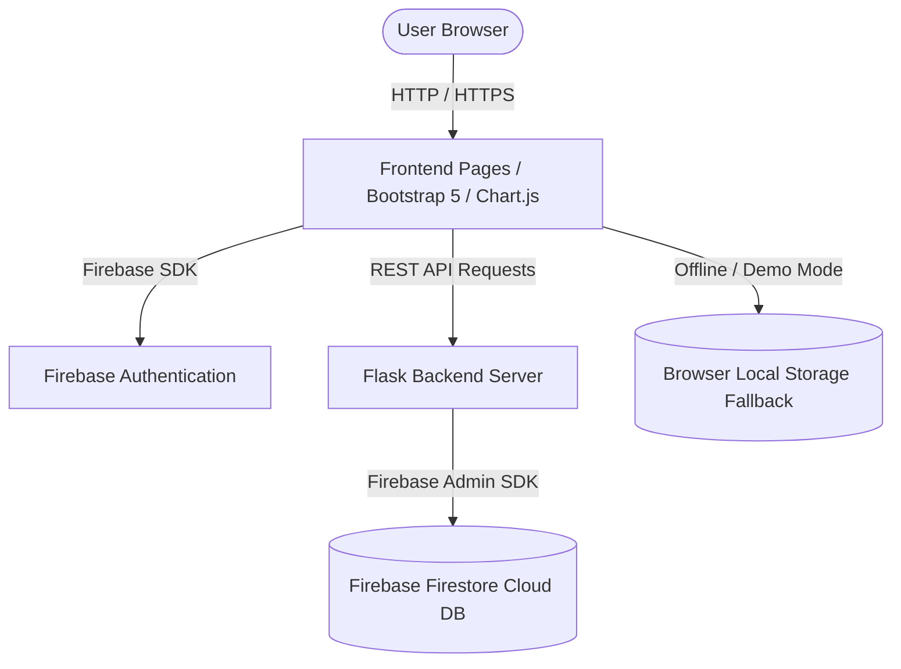

# Inventory Management System 📦⚡

A complete, production-ready, full-stack Cloud Computing web application for enterprise product tracking, stock monitoring, category management, and real-time inventory analytics.


---

## 🌟 Key Features

1. **🔒 Secure Authentication**: Firebase Authentication (Email & Password) with session persistence and route protection.
2. **📊 Real-time Analytics Dashboard**:
   - Total Products Metric
   - Total Categories Metric
   - Total Stock Volume
   - Net Inventory Valuation ($)
   - Low Stock Alert Count (< 5 units)
3. **🛒 Product CRUD Operations**:
   - Add, Edit, Delete, and View product details.
   - Live image upload preview & base64 storage.
   - Form validation & duplicate product name prevention.
4. **⚠️ Low Stock Warning System**: Automatic alert badges and highlight counters when item quantity falls below 5 units.
5. **🔍 Advanced Search, Filter & Sort**:
   - Real-time instant search by name, ID, brand, or supplier.
   - Category-based filter dropdown.
   - Sorting by Name (A-Z/Z-A), Price (Low-High/High-Low), and Quantity.
6. **🏷️ Category Management**: Create and track categories with item count indicators.
7. **📈 Visual Charts**: Interactive Stock Level Distribution Bar Chart and Category Share Doughnut Chart powered by Chart.js.
8. **📄 Printable & Exportable Reports**: Executive Inventory Audit report with one-click CSV export and printable PDF layout.
9. **💎 Glassmorphic Dark Blue Theme**: Premium UI designed with Bootstrap 5, custom CSS variables, and smooth micro-animations.

---

## 🏗️ Technology Stack

| Layer | Technologies |
| :--- | :--- |
| **Frontend** | HTML5, CSS3 (Vanilla + Glassmorphism), JavaScript (ES6+), Bootstrap 5, Chart.js, Bootstrap Icons |
| **Backend** | Python 3, Flask REST API, Flask-CORS, Gunicorn |
| **Database** | Firebase Firestore (Cloud NoSQL Database) + Local Storage Fallback Engine |
| **Authentication** | Firebase Authentication (Email & Password) |
| **Deployment** | Firebase Hosting, Render / Vercel |

---

## 📁 Directory Structure

```text
Inventory_Management_System/
├── frontend/
│   ├── css/
│   │   ├── style.css          # Core dark blue glassmorphism theme & design system
│   │   ├── dashboard.css      # Dashboard metric cards & chart layouts
│   │   └── login.css          # Auth pages styling
│   ├── js/
│   │   ├── firebase.js       # Firebase initialization & local storage fallback adapter
│   │   ├── auth.js           # Auth sign-in, registration, session guard
│   │   ├── app.js            # Global UI helpers, toasts, formatters
│   │   ├── dashboard.js      # Stats loader & Chart.js graph engine
│   │   └── products.js       # Product CRUD, search, filter, sort, image upload
│   ├── pages/
│   │   ├── login.html
│   │   ├── register.html
│   │   ├── dashboard.html
│   │   ├── products.html
│   │   ├── categories.html
│   │   └── reports.html
│   └── index.html             # Landing & session router
├── backend/
│   ├── app.py                 # Flask server entry point
│   ├── config.py              # Application settings
│   ├── firebase_config.py     # Firebase Admin SDK & mock Firestore driver
│   ├── requirements.txt       # Python dependencies
│   ├── models/
│   │   ├── product_model.py
│   │   └── category_model.py
│   └── routes/
│       ├── auth_routes.py
│       ├── product_routes.py
│       ├── category_routes.py
│       └── report_routes.py
├── docs/
│   ├── INSTALLATION.md        # Step-by-step setup guide
│   ├── PROJECT_REPORT.md      # Academic/Engineering cloud project report
│   ├── API_DOCUMENTATION.md   # REST API endpoint details
│   ├── DATABASE_SCHEMA.md     # Firestore collections & schema
│   └── DEPLOYMENT_GUIDE.md    # Hosting on Firebase & Render
└── README.md
```

---

## ⚙️ System Architecture



---

## 🚀 Quick Start Guide

### 1. Prerequisites
- Python 3.9+ installed
- Node.js / NPM (optional for hosting tools)

### 2. Backend Setup
```bash
# Navigate to backend folder
cd backend

# Create a virtual environment
python -m venv venv
source venv/bin/activate  # On Windows: venv\Scripts\activate

# Install dependencies
pip install -r requirements.txt

# Start the Flask API server
python app.py
```
The server will start at `http://localhost:5000`.

### 3. Running the Frontend
Open `frontend/index.html` directly in your browser, or serve it using Python:
```bash
# Serve frontend on port 8000
python -m http.server 8000 --directory frontend
```
Navigate to `http://localhost:8000`.

---

## 📜 License
Distributed under the MIT License. See `LICENSE` for details.
